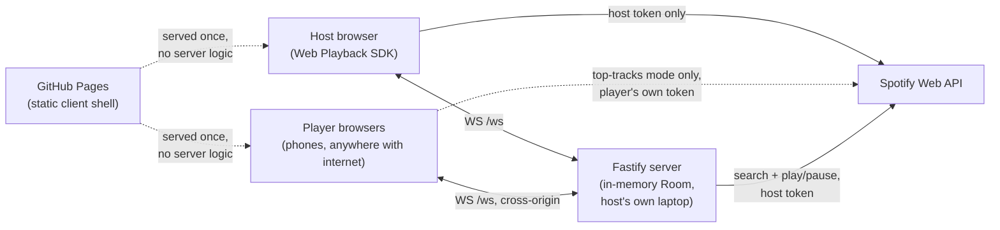

# ARCHITECTURE

How Song Snitch is structured and how data flows. Audience: agents changing system
structure, concurrency, request flow, or deployment. For *why* specific choices were made
see [DECISIONS.md](DECISIONS.md); for business rules see [DOMAIN.md](DOMAIN.md); for
dependencies and commands see [STACK.md](STACK.md).

## System overview

One Fastify process on the host's own laptop runs the whole game: two React entry
points (host screen, player screen), one WebSocket for all real-time state, and it's
the only server-side thing that ever talks to Spotify. The BUILT CLIENT is now also
published to GitHub Pages (see [DECISIONS.md](DECISIONS.md) ADR-005) — a different,
public origin players load the app shell from — but the game server itself is never
deployed anywhere; every player's browser still opens a WebSocket straight to the
host's own LAN-bound Fastify process for actual gameplay.

<!-- markdownlint-disable MD046 -->

<!-- markdownlint-enable MD046 -->

## Layers & dependency rules

Dependencies point down this table; nothing below imports from something above it.

| Layer | Folder | Responsibility |
| --- | --- | --- |
| Wire contract | `shared/types.ts` | Client/server message and state shapes. No imports either direction. |
| Game state | `server/game.ts` | The one `Room`; every state transition; the only writer of game state. |
| Spotify | `server/spotify.ts` | The only file that knows a Spotify URL — auth, search, play/pause. |
| Network guard | `server/net.ts` | LAN/loopback checks, used by `index.ts`, `routes.ts`, `ws.ts`. |
| Transport | `server/ws.ts`, `server/routes.ts` | Socket registry + HTTP routes; call `game.ts`, hold no game state themselves. |
| Bootstrap | `server/index.ts` | Wires everything above and binds the port. |
| Client | `src/*.tsx`, `src/net.ts` | Two React apps sharing `shared/types.ts`; render whatever the server last sent. |

Entry point: `server/index.ts` → registers the net guard, routes, and WS handler, then
`app.listen()`.

## Major components

| Component | Location | Responsibility |
| --- | --- | --- |
| Room state machine | `server/game.ts` | `lobby → playing → reveal → finished`; scoring; round-end arbitration |
| Spotify integration | `server/spotify.ts` | PKCE auth, token refresh, search, play/pause |
| WebSocket router | `server/ws.ts` | Per-connection identity, message dispatch, broadcast |
| Host screen | `src/HostApp.tsx` | Shared display: room code/QR, now playing, reveal, leaderboard |
| Player screen | `src/PlayerApp.tsx` | Join, submit songs, guess, see your own result |

## Concurrency model

Single Node process, single event loop. **One `Room`, held in a module-level variable in
`server/game.ts` — not a `Map<code, Room>`.** One host, one Premium account, one set of
speakers; two concurrent rooms would fight over the same playback device. See ADR-001.

The one real race: three round-end triggers (all connected non-submitters voted, the
track finished, the host tapped Skip) can arrive in the same tick or interleave across an
`await`. `endRound()` is synchronous through the phase flip and the broadcast, so only
whichever trigger arrives first has any effect — every later one sees `round.endReason`
already set and no-ops.

## Request & data flow

1. **Host auth** — `/auth/login` → Spotify consent → the shared GitHub Pages bounce page
   (`public/callback.html`) → back to `/host#code=&state=` (a URL fragment, invisible
   to any server) → `HostApp.tsx` reads it and `POST /api/host/complete-login`
   exchanges the PKCE code, checks the account is Premium, sets an `HttpOnly` cookie.
   See [DECISIONS.md](DECISIONS.md) ADR-005 for why this moved off a server-rendered
   `/callback` redirect.
2. **Room creation** — host's WS sends `host:createRoom`; `game.createRoom()` replaces
   the module's `room` wholesale and broadcasts the new `HostState`.
3. **Player join** — player's WS sends `player:join`; `game.joinRoom()` validates
   uniqueness/capacity server-side and returns a random id+token, persisted client-side
   in `sessionStorage` for reconnect.
4. **Submission** — `player:submit`, validated against `songsPerPlayer` and cross-player
   duplicate tracks, all server-side.
5. **Start** — `host:start` builds one `Round` per submitted track, shuffles, and starts
   round 0; `armRound()` calls Spotify `play()` and arms a `durationMs`-based timer.
6. **Round loop** — votes arrive over WS (`player:vote`); the track-ended signal arrives
   from either the SDK (client) or the server's own timer; whichever end trigger wins
   calls `endRound()`, which scores, builds the one `Reveal`, and pauses playback.
7. **Finish** — `nextRound()` past the last round sets `phase: 'finished'`; clients render
   the leaderboard from the roster's `score` field already broadcast throughout.

## Where does a new file go?

| I am adding… | It goes in… |
| --- | --- |
| A new WS message type | `shared/types.ts` (`ClientMsg`/`ServerMsg`), `server/ws.ts` (dispatch), `server/game.ts` (the actual transition) |
| A new Spotify API call the SERVER makes | `server/spotify.ts` only |
| A new host-screen or player-screen UI piece | `src/HostApp.tsx` or `src/PlayerApp.tsx` — both are intentionally single-file, see [STACK.md](STACK.md) |

## Integration points

| Integration | Purpose | Auth |
| --- | --- | --- |
| Spotify Web API + Web Playback SDK | Catalog search, playback control, in-browser audio | Host's own PKCE user token — no client secret exists in this project |
| Spotify Web API, `top-tracks` mode only | A player's own top-tracks fetch, direct from their phone (`src/spotify-top-tracks.ts`) | That player's own PKCE user token, held only in their browser's memory — see [SECURITY.md](SECURITY.md) |
| GitHub Pages | Publishes the built client shell (both screens + the OAuth bounce page) — no server logic | Public, no auth — see [DECISIONS.md](DECISIONS.md) ADR-005 |

## Deployment topology

The GAME SERVER has no deployment target and never will — Song Snitch runs entirely on
the host's own laptop for the length of one game night: `Start-Project.bat` (or
`npm start`) builds and serves on `0.0.0.0:5178`, phones join over the same WiFi. No TLS
termination, no health-check platform — `/api/health` exists only for the launcher's
own single-instance check.

The CLIENT SHELL (both screens' built HTML/JS/CSS, plus the OAuth bounce page) is
separately published to **GitHub Pages** via `.github/workflows/pages.yml`, triggered
on push to `main` — `npm run build:pages` (a `--base=/Song-Snitch/` build to a separate
`dist-pages/`, never colliding with the host's own local `dist/`). This is a static
publish only: no server, no secrets, nothing that talks to a database or holds state.
See [DECISIONS.md](DECISIONS.md) ADR-005.

## Not in the architecture (yet)

No persistence layer of any kind (deliberate — see ADR-001); no queue; no auth beyond
the host's own Spotify session; no i18n; no multi-room support. What breaks first if
this scaled up: the single in-memory `Room` (one game at a time, full stop) and the
single Spotify Premium device (one audio output, full stop) — both are the actual
product, not accidental limits.
