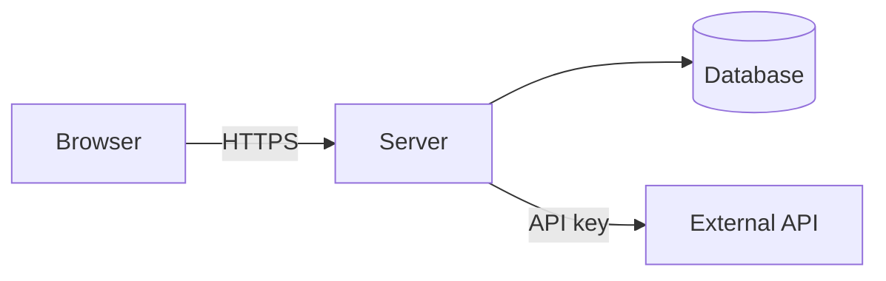

# ARCHITECTURE

How Song Snitch is structured and how data flows. Audience: agents changing system
structure, concurrency, request flow, or deployment. For *why* specific choices were made
see [DECISIONS.md](DECISIONS.md); for business rules see [DOMAIN.md](DOMAIN.md); for
dependencies and commands see [STACK.md](STACK.md).

## System overview

<!-- One line of flow, then a diagram. Mermaid renders on GitHub; ASCII is fine too.

<!-- markdownlint-disable MD046 -->

<!-- markdownlint-enable MD046 -->
-->

## Layers & dependency rules

State the direction dependencies are allowed to flow, then never import upward.

| Layer | Folder | Responsibility |
| --- | --- | --- |
| … | … | … |

Entry point: <!-- e.g. `app.py` → `create_app()`, `server/index.ts` -->

## Major components

| Component | Location | Responsibility |
| --- | --- | --- |
| … | … | … |

## Concurrency model

<!-- Only if the project has one. Name every pool/thread/worker, its size, and what
     happens on saturation. Then list state that is per-process and NOT shared across
     workers — in-memory caches, rate limiters, token buckets. That distinction is the
     single most common source of "works locally, wrong in production". -->

## Request & data flow

<!-- A sequence diagram or numbered walkthrough of the main path, including the failure
     branches (invalid input, saturated queue, timeout). -->

## Where does a new file go?

| I am adding… | It goes in… |
| --- | --- |
| … | … |

## Integration points

| Integration | Purpose | Auth |
| --- | --- | --- |
| … | … | … |

## Deployment topology

<!-- What runs where, what terminates TLS, what the start command is, and where the
     health check lives. Environment variables and branch→environment mapping live in
     ../README.md — link, don't duplicate. -->

## Not in the architecture (yet)

<!-- What's deliberately not built: no queue, no cache, no auth, no i18n. Adding one is a
     dependency change — record it in STACK.md and the reasoning in DECISIONS.md, in the
     same change. Also note the known scaling limits: what breaks first, and at what point. -->
