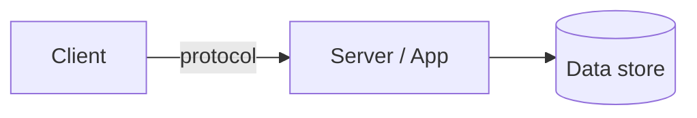
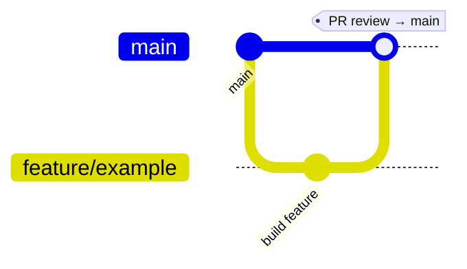

<!-- markdownlint-disable MD046 -->
<!--
  README TEMPLATE — modeled on AIRA's and Sales Intelligence Dashboard's READMEs, the two
  most-developed examples in this codebase (see CLAUDE.md § Docs-first). Both independently
  converged on the same skeleton below, so treat it as validated, not just a suggestion.

  WHO THIS IS FOR: humans — a stakeholder, a new teammate, future-you after six months.
  It owns setup, environment variables, deployment, and the pitch. The agent docs in
  CLAUDE.md/.claude/ own conventions, architecture, and rules. Every fact has exactly ONE
  owner — link across, never restate. When this file and a .claude/ doc disagree, that is
  a bug in the docs; fix it in the same change.

  THREE SHAPES — this template covers a deployed web app (the superset). Adapt per shape:
    - Deployed web app (AIRA)     → keep every section, including Deployment.
    - Local single-user tool (SID) → drop Deployment; add "Where Your Data Lives" and
                                      "Using the App"; "Getting Started" becomes a
                                      one-command Quick Start instead of a dev-mode walkthrough.
    - Desktop app (WPF)            → drop Deployment and Environment Variables; "Run
                                      Locally" becomes "Build & Run"; add a "Distribution"
                                      section (GitHub Releases, single-file publish); if
                                      the app elevates, say so and warn against repeatedly
                                      launching it during development.
  Delete sections that don't apply — don't leave a heading with nothing under it.

  CONVENTIONS TO KEEP (do not simplify these away, they're load-bearing):
    - `<a name="readme-top"></a>` at the very top, and a right-aligned
      "(back to top)" link after every major section — the file gets long, this is the
      only navigation.
    - The collapsible `<details open><summary>Table of Contents</summary>` ToC, with
      nested <ul> for a section's subsections. Keep its anchors in sync with real headings.
    - `---` between every major section.
    - GitHub alert syntax for callouts: `> [!NOTE]` for the AI-agent pointer,
      `> [!TIP]` for an optional manual/advanced path, `> [!WARNING]` for a placeholder
      or an accepted risk the reader must not mistake for finished work.
    - Badges via shields.io `for-the-badge` style, referenced by [label]: syntax and
      collected under a single `<!-- MARKDOWN LINKS & IMAGES -->` comment at the very
      bottom of the file — keeps the prose readable.
    - Mermaid diagrams render natively on GitHub — use `flowchart LR` for architecture,
      `gitGraph` for the branch model.
    - Tables over prose wherever there's more than three of anything (capabilities, env
      vars, brand colors, branches).
-->
<!-- markdownlint-enable MD046 -->

<a name="readme-top"></a>

<!-- HEADER -->
<div align="center">
  <!-- Drop the <a> logo block entirely if there's no logo yet. -->
  <a href="https://example.com">
    
  </a>

  <h1>Song Snitch</h1>
  <h3><!-- One-line promise, not a description. What changes for the user. --></h3>

  <p><!-- Audience + confidentiality marking if internal, e.g.
         🔒 Internal tool for <org> · C2 - Restricted Use
         For a personal project, keep the credit line below instead: --></p>
  <p>🔒 Personal project — <a href="https://vdwolde.com/">By vdWolde</a></p>
  <p>
    <!-- Omit "View App" if there's nothing deployed to link to. -->
    <a href="https://example.com">View App</a>
    &middot;
    <a href="https://github.com/OWNER/song-snitch/issues/new?labels=bug">Report a Bug</a>
    &middot;
    <a href="https://github.com/OWNER/song-snitch/issues/new?labels=enhancement">Request a Feature</a>
  </p>
</div>

---

<!-- TABLE OF CONTENTS — delete <li> rows for sections you removed -->
<details open>
  <summary><strong>Table of Contents</strong></summary>
  <ol>
    <li><a href="#about-the-project">About The Project</a></li>
    <li><a href="#architecture-at-a-glance">Architecture at a Glance</a></li>
    <li><a href="#built-with">Built With</a></li>
    <li>
      <a href="#getting-started">Getting Started</a>
      <ul>
        <li><a href="#prerequisites">Prerequisites</a></li>
        <li><a href="#run-locally">Run Locally</a></li>
        <li><a href="#troubleshooting">Troubleshooting</a></li>
      </ul>
    </li>
    <li><a href="#project-workflow">Project Workflow</a></li>
    <li><a href="#deployment">Deployment</a></li>
    <li><a href="#design-language--brand">Design Language &amp; Brand</a></li>
    <li><a href="#project-structure">Project Structure</a></li>
    <li><a href="#contributing--code-quality">Contributing &amp; Code Quality</a></li>
    <li><a href="#documentation">Documentation</a></li>
    <li><a href="#license">License</a></li>
    <li><a href="#contact">Contact</a></li>
  </ol>
</details>

---

## About The Project

**Song Snitch** is <!-- one dense paragraph: what it does, for whom, and the core
flow, the way AIRA's opener names the actor, the action, and the mechanism in one
sentence ("An employee enters an organization name... AIRA then runs parallel
deep-research queries... assembles a sourced, structured brief"). If the project is a
local-only tool, say so here plainly (SID: "Everything runs entirely on your laptop.
There is no cloud, no external API..."). If content/identity is still a placeholder,
say that too instead of inventing a name or copy — a `> [!WARNING]` callout beats a
README that quietly lies. -->

### Key Capabilities

<!-- One emoji + bold capability name + plain description per row. Five to eight rows.
     Pull these from PRODUCT.md's feature table — don't invent scope that isn't built. -->

| Capability | Description |
| --- | --- |
| 🔎 **…** | … |

> [!NOTE]
> For AI coding agents, start at **[CLAUDE.md](CLAUDE.md)** — Claude Code loads it
> automatically, and it routes to the document that owns each topic (in `.claude/` for
> the full-docs tier). See the [Documentation](#documentation) table below for the full
> map.

<p align="right">(<a href="#readme-top">back to top</a>)</p>

---

## Architecture at a Glance

<!-- Omit this whole section for a single-file script or a trivial tool — keep it for
     anything with more than one moving part. -->



The flow: **<!-- one bolded sentence, the same shape as AIRA's "Form (`POST /submit`) →
background task → Perplexity API (parallel) → PostgreSQL → polled by `/report/{id}`."
Name the real steps, not generic ones. --></strong>. Full diagrams live in
[ARCHITECTURE.md](.claude/ARCHITECTURE.md) <!-- or the lean CLAUDE.md's architecture
section for the lean tier -->.

<p align="right">(<a href="#readme-top">back to top</a>)</p>

---

## Built With

<!-- Badge row via shields.io for-the-badge style, references collected at the bottom
     of this file. Only badge what's actually load-bearing — five to ten, not every
     transitive dependency. -->

[![Tech][Tech.badge]][Tech-url]

- **Backend:** <!-- language, framework, version, package manager -->
- **Frontend:** <!-- if any -->
- **Data:** <!-- storage, if any -->

<p align="right">(<a href="#readme-top">back to top</a>)</p>

---

## Getting Started

### Prerequisites

<!-- A table for anything with more than one prerequisite; a sentence for one. Say what's
     mocked/optional so a reader doesn't chase a credential they don't need yet — AIRA's
     "Local development runs against a throwaway PostgreSQL container with Perplexity
     mocked — no API key... required just to run the app" is the model. -->

| Tool | Purpose | Notes |
| --- | --- | --- |
| … | … | … |

### Run Locally

<!-- Rename to "Quick Start" for a local tool (SID), "Build & Run" for a desktop app.
     Numbered code block, then a plain-language list of exactly what the one-click
     launcher does, in order — not "it sets things up", the actual numbered steps. -->

```sh
# 1. Clone
git clone https://github.com/OWNER/song-snitch.git
cd song-snitch

# 2. Start everything
<launcher>
```

`<launcher>` does the following:

1. …

> [!TIP]
> **Manual fallback** (no script): <!-- the raw commands, for when the launcher can't be
> used — matches AIRA's pattern of never making the one-click path the only path. -->

<!-- Only for a project with a distinct local/mock dev mode (AIRA-shaped):
### What Local Mode Does

| Concern | Local behavior |
| --- | --- |
| **Authentication** | … |
-->

<!-- Only for a local data tool (SID-shaped):
### Using the App

1. …

### Where Your Data Lives

| Path | Contents |
| --- | --- |
| … | … |

To **back up**: … To **start fresh**: …
-->

### Troubleshooting

<!-- Real symptoms you've actually hit, not hypothetical ones. -->

| Symptom | Fix |
| --- | --- |
| `node`/`dotnet` "is not recognized" | Prepend it to PATH for this shell — see the launcher header |
| … | … |

<p align="right">(<a href="#readme-top">back to top</a>)</p>

---

## Project Workflow

All work is committed and pushed from **VS Code Source Control** to the GitHub
repository. Default branch is **`main`** (never `master` — enforced by
`git config --global init.defaultBranch main`, see the root
[CLAUDE.md](../CLAUDE.md#git) if this is a personal project, or state the rule inline
here if this repo stands alone).



| Branch | Purpose | Auto-deploys to |
| --- | --- | --- |
| **`main`** | Stable, production-ready code | <!-- URL, or "—" if nothing deploys --> |
| **`feature/*`** | Larger changes, branched off `main`, merged back via PR | — |

<!-- If there's a real dev/staging environment with its own branch and its own deploy
     target (AIRA's `development` → aira-dev.ssghosting.net), add that row and describe
     who reviews PRs into `main` and what triggers a production deploy. -->

<p align="right">(<a href="#readme-top">back to top</a>)</p>

---

## Deployment

<!-- DELETE this whole section for a local-only tool or a desktop app that ships via
     GitHub Releases instead — replace it with a short "Distribution" section for
     desktop apps (publish command, where the exe lands, code-signing status). -->

<!-- Host/config table (AIRA's Deployment Center table, or SID's railway.toml summary),
     the exact start command (migrations run BEFORE the server boots), and the runtime
     infrastructure bullets. -->

### Environment Variables

All secrets come from the platform's environment settings — **never hardcoded**. See
`.env.example` or the config module for the full list and defaults.

| Variable | Required | Purpose |
| --- | --- | --- |
| … | … | … |

> [!TIP]
> **Health check:** `GET /health` <!-- or /api/health --> → `<!-- exact response body -->`.

<p align="right">(<a href="#readme-top">back to top</a>)</p>

---

## Design Language & Brand

<!-- Only if there's a UI with an actual brand — delete for a headless tool or an
     unbranded internal script. -->

Design tokens are defined in `<!-- tailwind.config.js / globals.css / a
ResourceDictionary -->` and consumed through <!-- utility classes / a theme provider -->.

### Brand Colors

| Token | Hex | Swatch |
| --- | --- | :---: |
| `…` | `#……` |  |

### Typography

| Role | Typeface | Fallback |
| --- | --- | --- |
| … | … | … |

<p align="right">(<a href="#readme-top">back to top</a>)</p>

---

## Project Structure

```text
<!-- Annotated top-level tree, one line per folder — not every file. Depth belongs in
     ARCHITECTURE.md; this is the orientation view. -->
```

A fully annotated file map and code patterns live in **[CLAUDE.md](CLAUDE.md)**
<!-- or .claude/ARCHITECTURE.md for the full-docs tier -->.

<p align="right">(<a href="#readme-top">back to top</a>)</p>

---

## Contributing & Code Quality

- **Quality gate:** <!-- the exact command that must stay clean, e.g. `npm run
  typecheck`, `ruff check`, `dotnet test` -->.
- **Code review:** after writing or modifying code, run **`/code --commit`**
  (configured by [.claude/REVIEW.md](.claude/REVIEW.md))
  before considering the task done.
- **AI agent guides** live under <!-- .claude/ or the root CLAUDE.md -->.

<p align="right">(<a href="#readme-top">back to top</a>)</p>

---

## Documentation

<!-- Mirror CLAUDE.md's routing table in human terms. Delete rows for docs this project
     doesn't have — don't pad the table to look complete. -->

| Document | What's inside |
| --- | --- |
| [CLAUDE.md](CLAUDE.md) | Entry point for AI agents: hard rules + routing index |
| [.claude/PRODUCT.md](.claude/PRODUCT.md) | Goals, non-goals, known gaps |
| [.claude/ARCHITECTURE.md](.claude/ARCHITECTURE.md) | Structure, data flow, deployment topology |
| [.claude/STACK.md](.claude/STACK.md) | Conventions, patterns, commands, quality gates |
| [.claude/SECURITY.md](.claude/SECURITY.md) | Threat model, controls, secrets |
| [.claude/DECISIONS.md](.claude/DECISIONS.md) | ADR log — why things are the way they are |

<p align="right">(<a href="#readme-top">back to top</a>)</p>

---

## License

All rights reserved — Thomas van der Wolde (vdWolde). Personal project, not licensed
for reuse or redistribution.
<!-- Replace with "Proprietary — internal use only." for a work project (see AIRA's
     exact wording), or the actual OSS license terms if this one is open source. -->

<p align="right">(<a href="#readme-top">back to top</a>)</p>

---

## Contact

**Thomas van der Wolde** (vdWolde) — [https://vdwolde.com/](https://vdwolde.com/)

<p align="right">(<a href="#readme-top">back to top</a>)</p>

<!-- MARKDOWN LINKS & IMAGES — shields.io for-the-badge style. Only badge what's real. -->
[Tech.badge]: https://img.shields.io/badge/Tech-000000?style=for-the-badge&logo=tech&logoColor=white
[Tech-url]: https://example.com
