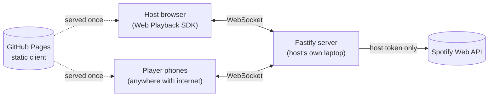
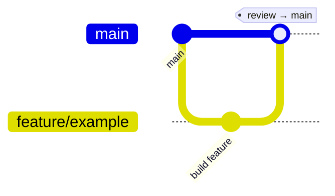

<a name="readme-top"></a>

<!-- HEADER -->
<div align="center">
  <h1>Song Snitch</h1>
  <h3>Turn a room's own Spotify library into a party guessing game.</h3>

  <p>🔒 Personal project — <a href="https://vdwolde.com/">By vdWolde</a></p>
  <p>
    <a href="https://github.com/vdwolde/Song-Snitch/issues/new?labels=bug">Report a Bug</a>
    &middot;
    <a href="https://github.com/vdwolde/Song-Snitch/issues/new?labels=enhancement">Request a Feature</a>
  </p>
</div>

---

<details open>
  <summary><strong>Table of Contents</strong></summary>
  <ol>
    <li><a href="#about-the-project">About The Project</a></li>
    <li><a href="#architecture-at-a-glance">Architecture at a Glance</a></li>
    <li><a href="#built-with">Built With</a></li>
    <li>
      <a href="#getting-started">Getting Started</a>
      <ul>
        <li><a href="#prerequisites">Prerequisites</a></li>
        <li><a href="#quick-start">Quick Start</a></li>
        <li><a href="#using-the-app">Using the App</a></li>
        <li><a href="#troubleshooting">Troubleshooting</a></li>
      </ul>
    </li>
    <li><a href="#project-workflow">Project Workflow</a></li>
    <li><a href="#deployment">Deployment</a></li>
    <li><a href="#design-language--brand">Design Language &amp; Brand</a></li>
    <li><a href="#project-structure">Project Structure</a></li>
    <li><a href="#contributing--code-quality">Contributing &amp; Code Quality</a></li>
    <li><a href="#documentation">Documentation</a></li>
    <li><a href="#license">License</a></li>
    <li><a href="#contact">Contact</a></li>
  </ol>
</details>

---

## About The Project

**Song Snitch** turns a room's own Spotify library into a party game. One host laptop
with a Spotify Premium account plays each submitted track out loud; everyone else joins
from their own phone's browser — no app install, no Spotify account needed (unless the
host turns on auto-import mode, see below) — and guesses who added the song that's
playing. The actual game runs entirely on the host's own WiFi for the length of one
evening: no game server to deploy, no data that outlives the process (see
[.claude/DECISIONS.md](.claude/DECISIONS.md) ADR-001). The app itself, though, is
published to GitHub Pages so players load it from the internet instead of typing a LAN
address (see ADR-005) — see [Deployment](#deployment) below.

### Key Capabilities

| Capability | Description |
| --- | --- |
| 🔍 **Search, don't log in** | Players search Spotify's catalog through the host's own account — no Spotify login needed to play |
| 🔁 **Auto-import top tracks** | Optional mode: each player connects their own Spotify and their most-played songs are submitted automatically, picking a different set on repeat games |
| 📺 **Shared screen + phone controllers** | One host laptop shows the game; everyone else's phone is just a controller — plays like Kahoot or Jackbox |
| 🏆 **Live scoring & reveal** | Points update and the answer reveals after every round, not just at the end |
| 📱 **QR code join** | Scan once instead of typing an IP address into eight phones |

> [!NOTE]
> For AI coding agents, start at **[CLAUDE.md](CLAUDE.md)** — Claude Code loads it
> automatically, and it routes to the document that owns each topic under `.claude/`.
> See the [Documentation](#documentation) table below for the full map.

<p align="right">(<a href="#readme-top">back to top</a>)</p>

---

## Architecture at a Glance



The flow: **Host connects Spotify → creates a room → players join and submit songs →
host starts → each round plays on the host's speakers while phones vote → reveal →
final leaderboard.** The app shell (both screens) loads from GitHub Pages; every
player's phone still talks directly to the host's own laptop over WebSocket for actual
gameplay — see [Deployment](#deployment). Full diagrams and the round-end race
condition live in [.claude/ARCHITECTURE.md](.claude/ARCHITECTURE.md).

<p align="right">(<a href="#readme-top">back to top</a>)</p>

---

## Built With

[![Node.js][Node.badge]][Node-url]
[![TypeScript][TypeScript.badge]][TypeScript-url]
[![React][React.badge]][React-url]
[![Fastify][Fastify.badge]][Fastify-url]

- **Backend:** Node.js 22+, TypeScript (ESM, no compile step via `tsx`), Fastify 5 +
  `@fastify/websocket`, npm
- **Frontend:** React 19, Vite 6, plain CSS (no framework)
- **Data:** none — game state is in-memory only, nothing persists past the process

<p align="right">(<a href="#readme-top">back to top</a>)</p>

---

## Getting Started

### Prerequisites

| Tool | Purpose | Notes |
| --- | --- | --- |
| Node.js 22.5+ | Runtime | Needed for `process.loadEnvFile()` |
| Spotify Premium account (host only) | Required for the Web Playback SDK to play audio | Players need no Spotify account of their own |
| A Spotify Developer app | Provides `SPOTIFY_CLIENT_ID` | Register at [developer.spotify.com/dashboard](https://developer.spotify.com/dashboard) with redirect URI exactly `https://vdwolde.github.io/Song-Snitch/callback.html` — see `.env.example` |

> [!NOTE]
> That's the only redirect URI ever registered — used for both the host's own login
> and, in **top-tracks mode** (each player's own Spotify top tracks, auto-imported —
> see [.claude/DECISIONS.md](.claude/DECISIONS.md) ADR-005), a player's login too. It's
> a static page (`public/callback.html`) published automatically as part of the GitHub
> Pages deploy — see [Deployment](#deployment) — nothing to upload by hand.

### Quick Start

```sh
git clone https://github.com/vdwolde/Song-Snitch.git
cd Song-Snitch
```

Copy `.env.example` to `.env` and fill in `SPOTIFY_CLIENT_ID`, then run
**`Start-Project.bat`**.

`Start-Project.bat` does the following:

1. Checks Node.js is on `PATH` (22+).
2. Installs dependencies on first run, or whenever `package.json` has changed.
3. Builds the client, then starts the server bound to your LAN — printing both the
   host's own URL and the URL phones should join. The first LAN connection may trigger
   a Windows Firewall prompt; choose **Private networks** and **Allow**, or phones won't
   connect.

> [!TIP]
> **Manual fallback** (no script): `npm install && npm run build`, then
> `set BIND_LAN=1&& set OPEN_BROWSER=1&& npm run serve` (PowerShell:
> `$env:BIND_LAN=1; $env:OPEN_BROWSER=1; npm run serve`). Omit `BIND_LAN` to stay
> loopback-only, e.g. while developing alone.

### Using the App

1. On the host laptop, open `http://127.0.0.1:5178/host` (the host's OWN copy, always
   this address — never the GitHub Pages one, see [Deployment](#deployment)) and
   connect Spotify (Premium).
2. Set songs-per-player, pick a mode (**everyone picks songs**, or **auto — everyone's
   top tracks**), and create the room — note the room code and QR code shown.
3. Each player scans the QR (or opens the join link shown, a `vdwolde.github.io` URL)
   on their phone, picks a name and colour. In manual mode they search for and submit
   that many songs; in top-tracks mode they tap **Connect Spotify** and their
   most-played songs are added automatically.
4. Once everyone's submitted enough, tap **Start game** on the host screen.
5. Each round, the host plays a track while everyone guesses on their phone who added
   it. The host can tap **Skip to next song** at any time.
6. After the last round, the final leaderboard shows the winner.

### Troubleshooting

| Symptom | Fix |
| --- | --- |
| `node` "is not recognized" | Prepend it to `PATH` for this shell — see the Development base's `CLAUDE.md` § Windows dev-machine hygiene |
| Phones can't reach the join URL | Check for a dismissed Windows Firewall prompt; also confirm the router doesn't have AP/client (guest network) isolation enabled — test this before the party, not at it |
| A phone has no internet (can't load the GitHub Pages join link) | It can still join if it's on the host's WiFi: open the LAN address the host screen prints in its own terminal directly — same app, served by the host's own laptop instead of GitHub Pages |
| "Spotify Premium is required to host" | The Web Playback SDK needs a full Premium plan — Premium Mini/Lite aren't supported |
| **Start game** stays disabled | Every player needs exactly `songsPerPlayer` submissions, and the host's Spotify playback device must finish connecting first |

<p align="right">(<a href="#readme-top">back to top</a>)</p>

---

## Project Workflow

Default branch is **`main`** — see the Development base's
[CLAUDE.md § Git](../../CLAUDE.md#git). Solo personal project: no PR review process,
changes land directly.



| Branch | Purpose | Auto-deploys to |
| --- | --- | --- |
| **`main`** | Stable code | GitHub Pages (client shell only — see [Deployment](#deployment); the game server itself never deploys anywhere) |
| **`feature/*`** | Larger changes, merged back into `main` | — |

<p align="right">(<a href="#readme-top">back to top</a>)</p>

---

## Deployment

There is still no deployment target for the actual GAME — it only ever runs on the
host's own laptop, for the length of one game night (see
[.claude/DECISIONS.md](.claude/DECISIONS.md) ADR-001). What IS deployed is the built
CLIENT SHELL — both screens plus the Spotify OAuth bounce page — published to
**GitHub Pages** at `https://vdwolde.github.io/Song-Snitch/`, so a player's phone loads
the app from the internet instead of needing to know the host's LAN address. See
ADR-005 for the full reasoning.

| What | Where | Trigger |
| --- | --- | --- |
| Client shell (`npm run build:pages`) | GitHub Pages | `.github/workflows/pages.yml`, on every push to `main` |
| Game server | The host's own laptop, always | `Start-Project.bat` / `npm start` — never deployed anywhere |

A player's phone still opens a WebSocket straight to the host's own LAN-bound server
for actual gameplay — loading the app from a public CDN doesn't change who can *play*,
only where the HTML/JS/CSS bytes come from. See [Troubleshooting](#troubleshooting) for
the no-internet fallback.

<p align="right">(<a href="#readme-top">back to top</a>)</p>

---

## Design Language & Brand

Design tokens are CSS custom properties in `src/styles.css`'s `:root` block — the only
source of color in this project; never hardcode a hex value in a component. Full
palette (including the 8 fixed player colours) and interaction rules live in
[.claude/DESIGN.md](.claude/DESIGN.md).

### Brand Colors

| Token | Hex | Swatch |
| --- | --- | :---: |
| `--bg` | `#0f172a` |  |
| `--accent` | `#3b82f6` |  |
| `--gold` | `#eab308` |  |
| `--good` | `#22c55e` |  |
| `--bad` | `#f43f5e` |  |

Typography: **Anton** (display — room code, brand title, result banners) paired with
**Epilogue** (body/UI, including all Spotify track data), both via Google Fonts. See
[.claude/DESIGN.md](.claude/DESIGN.md) for exactly where each is scoped.

<p align="right">(<a href="#readme-top">back to top</a>)</p>

---

## Project Structure

```text
shared/               Wire contract shared between client and server, and the top-tracks picker
server/               Fastify + WebSocket backend, Spotify integration, in-memory game state
src/                  React client — host screen, player screen, shared styles
public/               Static files Vite publishes verbatim — the Spotify OAuth bounce page
.github/workflows/    CI (typecheck + build) and the GitHub Pages deploy
.claude/              Agent-facing docs — architecture, security, decisions, and more
```

A fully annotated file map and code patterns live in
[.claude/ARCHITECTURE.md](.claude/ARCHITECTURE.md) and
[.claude/STACK.md](.claude/STACK.md).

<p align="right">(<a href="#readme-top">back to top</a>)</p>

---

## Contributing & Code Quality

- **Quality gate:** `npm run typecheck && npm test`.
- **Code review:** run `/code --commit` (configured by
  [.claude/REVIEW.md](.claude/REVIEW.md)) when you actually want a review that turn —
  not automatically after every change.
- **AI agent guides** live under [.claude/](.claude/), routed from [CLAUDE.md](CLAUDE.md).

<p align="right">(<a href="#readme-top">back to top</a>)</p>

---

## Documentation

| Document | What's inside |
| --- | --- |
| [CLAUDE.md](CLAUDE.md) | Entry point for AI agents: hard rules + routing index |
| [.claude/PRODUCT.md](.claude/PRODUCT.md) | Goals, non-goals, known gaps |
| [.claude/ARCHITECTURE.md](.claude/ARCHITECTURE.md) | Structure, data flow, deployment topology |
| [.claude/DOMAIN.md](.claude/DOMAIN.md) | Game state model, scoring, round lifecycle |
| [.claude/API.md](.claude/API.md) | HTTP routes and the full WebSocket protocol |
| [.claude/STACK.md](.claude/STACK.md) | Conventions, patterns, commands, quality gates |
| [.claude/SECURITY.md](.claude/SECURITY.md) | Threat model, controls, secrets |
| [.claude/DESIGN.md](.claude/DESIGN.md) | Brand tokens, layout, accessibility |
| [.claude/DECISIONS.md](.claude/DECISIONS.md) | ADR log — why things are the way they are |
| [.claude/GLOSSARY.md](.claude/GLOSSARY.md) | Project-specific terms |

<p align="right">(<a href="#readme-top">back to top</a>)</p>

---

## License

All rights reserved — Thomas van der Wolde (vdWolde). Personal project, not licensed
for reuse or redistribution.

<p align="right">(<a href="#readme-top">back to top</a>)</p>

---

## Contact

**Thomas van der Wolde** (vdWolde) — [https://vdwolde.com/](https://vdwolde.com/)

<p align="right">(<a href="#readme-top">back to top</a>)</p>

<!-- MARKDOWN LINKS & IMAGES -->
[Node.badge]: https://img.shields.io/badge/Node.js-339933?style=for-the-badge&logo=node.js&logoColor=white
[Node-url]: https://nodejs.org/
[TypeScript.badge]: https://img.shields.io/badge/TypeScript-3178C6?style=for-the-badge&logo=typescript&logoColor=white
[TypeScript-url]: https://www.typescriptlang.org/
[React.badge]: https://img.shields.io/badge/React-61DAFB?style=for-the-badge&logo=react&logoColor=black
[React-url]: https://react.dev/
[Fastify.badge]: https://img.shields.io/badge/Fastify-000000?style=for-the-badge&logo=fastify&logoColor=white
[Fastify-url]: https://fastify.dev/
